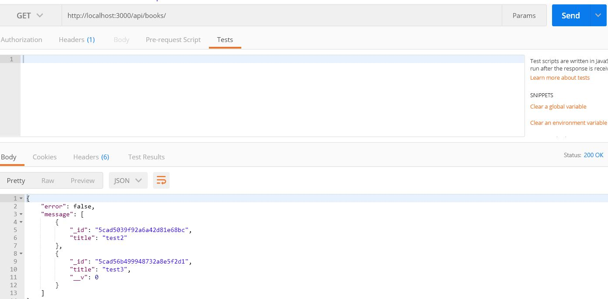

# WebAPI Express
Sample project using node js express and mongodb

## Prerequisites
already have nodejs installed

install express and mongo
```
npm install --save express mongoose
```

## Getting Started
in this repository there is 2 app
- simple app using jade view engine
- API app using mongo

run bellow command:

```
npm init
```
using express genertor
```
npm install express-generator -g
```
```
express myapp
npm install
```
### 1. express using jade view engine
about movie web app the design will be looks like this

with this app we learn about express, express generator, routing in express, static files and middleware, template and template engines, querystring.
### express for API
sample get request result

with this we learn how to create web api using node express and connecting to mongodb.
