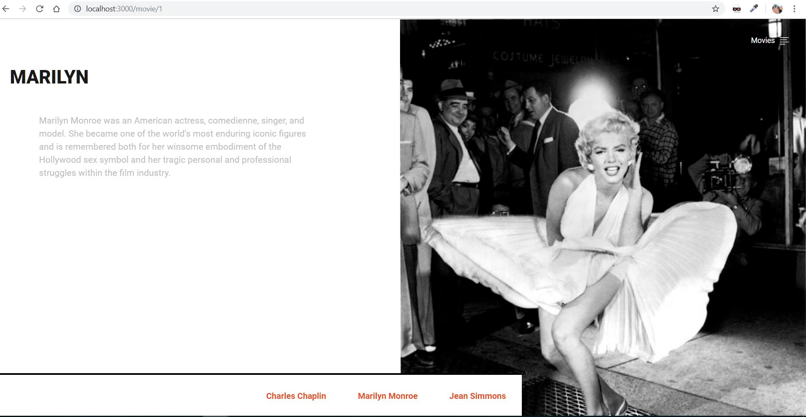

# WebAPI Express
Sample project using node js express and mongodb

## Prerequisites
already have nodejs installed

install express and mongo
```
npm install --save express mongoose
```

## Getting Started
in this repository there is 2 app
- simple app using jade view engine
- API app using mongo

```
npm init
```
using express genertor
```
npm install express-generator -g
```
```
express myapp
npm install
```
### express using jade view engine
about movie web app the design will be looks like this


### express for API
